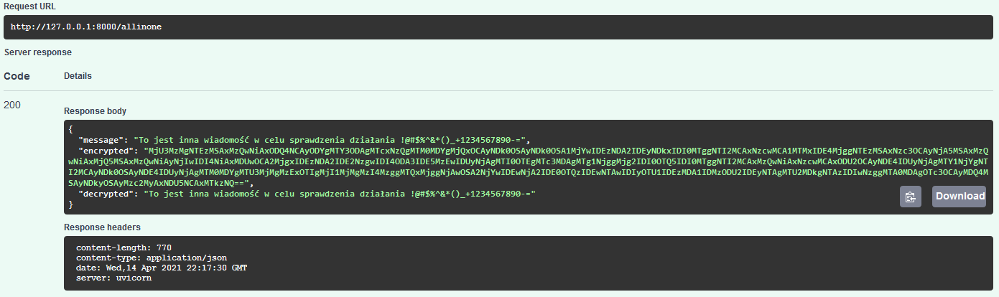
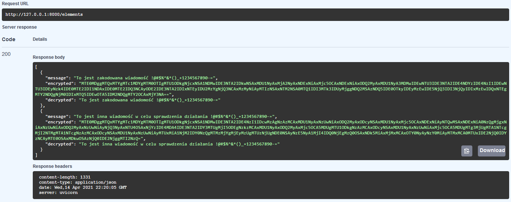
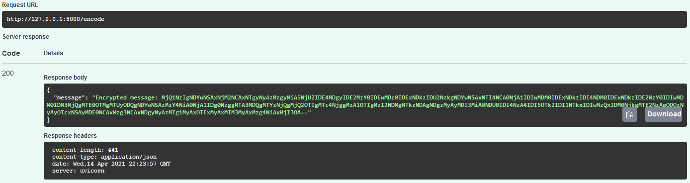

# RSACipher
Simple RSA cipher with FastAPI &amp; Unittests

Title: Recruitment task
Author: Hubert Knioła

Completed tasks:
- RSA Cipher - DONE
- Encode and decode methods - DONE
- Simple Unit Tests - DONE
- FastAPI Server with previous methods - DONE
- BasicAuth FastAPI - DONE
- Code documentations - DONE
- Dockerization - IN

API ENDPOINTS & EFFECTS

POST /allinone

  

GET /elements

  

POST /element/{id}

  

POST /encode

  

POST /decode

  

